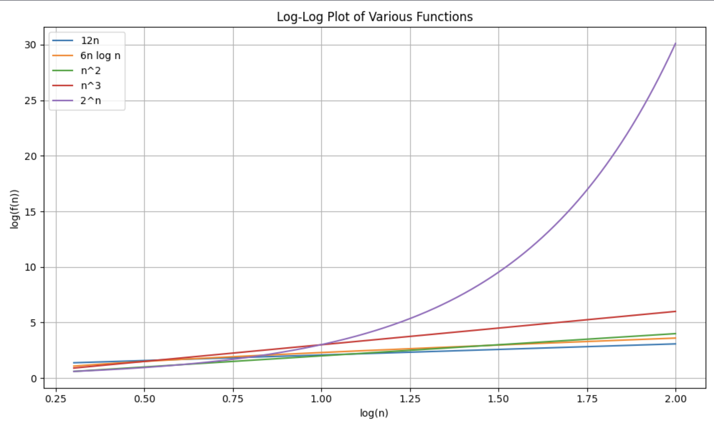

Question 1:

R-1.1 Graph the functions `12n`, `6n log n`, `n^2`, `n^3`, and `2^n` using logarithmic scale for the x- and y-axes; that is, if the function value f(n) is y, plot this as a point with x-coordinate at log n and y-coordinate at log y.

Answer:



---

Question 2:

R-1.2 Algorithm A uses 10n log n operations, while algorithm B uses n2 operations. Determine the value n0 such that A is better than B for n ≥ n0.

Answer

```
n >= 11
```

---

Question 3:

R-1.6 Order the following list of functions by the big-O notation. `nlogn` `loglogn` `5n` `n^3` `2n(log^2)n` `(n^2)logn` `1/n` `2^n` `4^(logn)` `4n^(3/2)` `4^n` `√n`

Answer:

1. `1/n`
2. `√n`
3. `nlogn`
4. `loglogn`
5. `5n`
6. `n^3`
7. `2n(log^2)n`
8. `(n^2)logn`
9. `2^n`
10. `4^(logn)`
11. `4n^(3/2)`
12. `4^n`

---

Question 4:

R-1.10 Give a big-O characterization, in terms of n, of the running time of the Loop1 method below:

```
Algorithm Loop1(n)
s ← 0
for i ← 1 to n do
    s ← s + i
```

Answer:
`O(n)`

---

Question 5:
R-1.14 Perform a similar analysis for method Loop5 below:

```
Algorithm Loop5(n)
s ← 0
for i ←  1 to n^2 do
    for j ←  1 to i do
        s ← s + i
```

Answer:
`O(n^4)`

---

Question 6:

A segment of an array is a pair (low,high) that represents the low and high indices of the elements in the segment of an array. Design a pseudo code algorithm SegmentSums that takes two segments, (low1,high1) and (low2,high2), and an array, arr, and returns the sums of the elements in these two segments. For example, suppose the two segments are (4,7) and (1,5), and arr=[7,4,3,6,4,10,12,8,2,17]. Then the two sums that would be returned are (34,27).

Answer:

```
Algorithm
SegmentSums(arr, (low1,high1), (low2,high2))
Input: arr, An array of integers
Output: Returns the sums of the elements in the specified two segments of the array

sum1 := 0
sum2 := 0
for i <- low1 to high1 do
    sum1 <- sum1 + arr[i]

for i <- low2 to high2 do
    sum2 <- sum2 + arr[i]

return sum1, sum2
```
